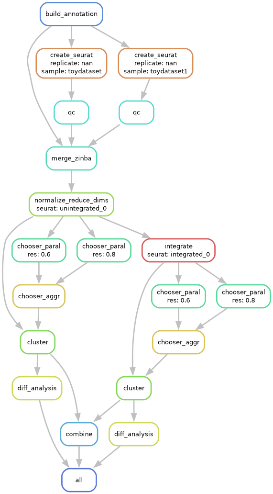

.. _rna:

scRNA-Seq Workflow
==================

The scRNA-Seq workflow starts with feature-by-barcode matrices and performs various 
QC steps and batch correction, clustering optimization, differential testing, and 
combines everything together into a single Seurat object for easy exploratory 
visualization and downstream analysis.

Specifically, the workflow does the following:

    - Load different formats (HDF5, MEX, RDS) from cellranger pipelines
    - Downloads genome annotation files
    - Normalizes and/or scales data based on assay type
    - Reduces technical variation and batch effects
    - Linear dimensional reduction
    - (Optional) optimizes clustering parameters
    - Non-linear dimensional reduction for visualizations
    - Weighted Nearest Neighbor analysis
    - Differential testing of gene expression

To configure a scRNA-Seq experiment, see :ref:`config-rna`.

